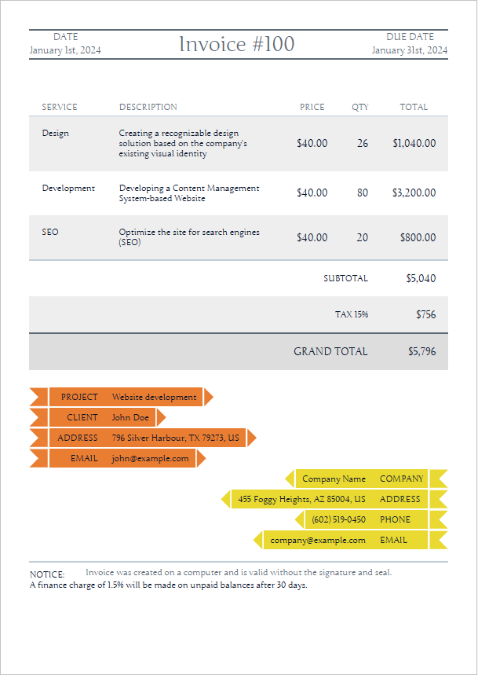

# SpringBooTex

SpringBooTex is PDF Generator REST Service which can be deplpyed out of the box. It can generate PDFs from LaTex and HTML Templates. It supports variable and file embeddings. 

Under the hood, it uses [pdfTeX / pdfLaTeX](https://tug.org/applications/pdftex) to create a PDF from a .tex file. For generating PDFs from HTML templates it uses [openhtmltopdf](https://github.com/danfickle/openhtmltopdf) and Thymeleaf.

## Getting Started
You can download the source code for SpringBooTex by running `git clone github.com/shuhanmirza/SpringBooTex` in your terminal.
After that you can run `docker-compose up --build`.

SpringBooTex will run as an REST service by default on port 10800; 

## Generating PDFs
PDF's are generated by sending an HTTP POST request to the endpoint "/api/generate-pdf" with a JSON payload:
```
{
    "templateType": "LATEX | HTML", 
    "templateSourceType": "BASE64",
    "templateSource": "TEMPLATE_SOURCE",
    "stringMap": { KEY_VALUE_MAP },
    "listMap" : { KEY_LIST_MAP },
    "fileUrlMap": { KEY_FILE_MAP },
    "responseType": "JSON | OCTET_STREAM | PDF"
}
```

### Example: Generating a PDF from latex template

See our example LaTex template in [`Doc/example.tex`](https://github.com/shuhanmirza/SpringBooTex/blob/main/Doc/example.tex)

You can see that, the variables are written between two `%` s.  
https://github.com/shuhanmirza/SpringBooTex/blob/49782f4cdd94a3e620f92739f7b37f381c3d77c0/Doc/example.tex#L12-L21

And the pdf has to embed an image file named `universe.jpg`  
https://github.com/shuhanmirza/SpringBooTex/blob/49782f4cdd94a3e620f92739f7b37f381c3d77c0/Doc/example.tex#L37-L38

Let's prepare the JSON payload.

At first, encode the latex template to base64 by running:
```bash
cat example.tex | base64
```
Which gives output:
```
XGRvY3VtZW50Y2xhc3NbYTRwYXBlciwxMXB0XXthcnRpY2xlfQpcdXNlcGFja2FnZXtncmFwaGljeH0KXHVzZXBhY2thZ2VbZW1wdHlde2Z1bGxwYWdlfQpcdXNlcGFja2FnZXtoeXBlcnJlZn0KXGh5cGVyc2V0dXB7CiAgICBjb2xvcmxpbmtzPXRydWUsCiAgICB1cmxjb2xvcj1ibHVlLAogICAgYnJlYWtsaW5rcz10cnVlCn0KXHVzZXBhY2thZ2V7YXJyYXlqb2J9Clx1c2VwYWNrYWdle211bHRpZG99CgpcbmV3Y29tbWFuZHtcZm9vZH17JUZPT0QlfQpcbmV3Y29tbWFuZHtcY2l0eX17JUNJVFklfQoKXG5ld2FycmF5XENvdW50cnlMaXN0ClxuZXdhcnJheVxDaXR5TGlzdAoKXHJlYWRhcnJheXtDb3VudHJ5TGlzdH17JUNPVU5UUllfTElTVCV9ClxyZWFkYXJyYXl7Q2l0eUxpc3R9eyVDSVRZX0xJU1QlfQpcbmV3Y29tbWFuZHtcTGlzdFNpemV9eyVMSVNUX1NJWkUlfQoKClx0aXRsZXtTcHJpbmdCb29UZXggRXhhbXBsZX0KXGRhdGV7fQpcYmVnaW57ZG9jdW1lbnR9CgpcbWFrZXRpdGxlCgpcc2VjdGlvbntTaW5nbGUgVmFyaWFibGV9CgpJIGFtIGZyb20gXGNpdHkuIEkgbG92ZSBlYXRpbmcgXGZvb2QuCgpcc2VjdGlvbntJbWFnZX0KVGhpcyBpbWFnZSB3YXMgZG93bmxvYWRlZCBmcm9tIFxocmVme2h0dHBzOi8vdXBsb2FkLndpa2ltZWRpYS5vcmcvd2lraXBlZGlhL2NvbW1vbnMvdGh1bWIvMi8yZi9IdWJibGVfdWx0cmFfZGVlcF9maWVsZC5qcGcvMTAyNHB4LUh1YmJsZV91bHRyYV9kZWVwX2ZpZWxkLmpwZ317V2lraXBlZGlhfQoKXHZzcGFjZXsxY219ClxpbmNsdWRlZ3JhcGhpY3Nbc2NhbGU9MC4yXXt1bml2ZXJzZS5qcGd9Cgpcc2VjdGlvbntBcnJheX0KCkxpc3Qgb2YgQ291bnRyaWVzIGFuZCB0aGVpciBDYXBpdGFscwoKXGJlZ2lue2l0ZW1pemV9CiAgICBcbXVsdGlkb3tcaT0xKzF9e1xMaXN0U2l6ZX17CiAgICAgICAgXGl0ZW0gXENvdW50cnlMaXN0KFxpKSA6IFxDaXR5TGlzdChcaSkKICAgIH0KXGVuZHtpdGVtaXplfQoKXGVuZHtkb2N1bWVudH0K
```

The JSON payload should look like this,
```json
{
    "templateType": "LATEX",
    "templateSourceType": "BASE64",
    "templateSource": "XGRvY3VtZW50Y2xhc3NbYTRwYXBlciwxMXB0XXthcnRpY2xlfQpcdXNlcGFja2FnZXtncmFwaGljeH0KXHVzZXBhY2thZ2VbZW1wdHlde2Z1bGxwYWdlfQpcdXNlcGFja2FnZXtoeXBlcnJlZn0KXGh5cGVyc2V0dXB7CiAgICBjb2xvcmxpbmtzPXRydWUsCiAgICB1cmxjb2xvcj1ibHVlLAogICAgYnJlYWtsaW5rcz10cnVlCn0KXHVzZXBhY2thZ2V7YXJyYXlqb2J9Clx1c2VwYWNrYWdle211bHRpZG99CgpcbmV3Y29tbWFuZHtcZm9vZH17JUZPT0QlfQpcbmV3Y29tbWFuZHtcY2l0eX17JUNJVFklfQoKXG5ld2FycmF5XENvdW50cnlMaXN0ClxuZXdhcnJheVxDaXR5TGlzdAoKXHJlYWRhcnJheXtDb3VudHJ5TGlzdH17JUNPVU5UUllfTElTVCV9ClxyZWFkYXJyYXl7Q2l0eUxpc3R9eyVDSVRZX0xJU1QlfQpcbmV3Y29tbWFuZHtcTGlzdFNpemV9eyVMSVNUX1NJWkUlfQoKClx0aXRsZXtTcHJpbmdCb29UZXggRXhhbXBsZX0KXGRhdGV7fQpcYmVnaW57ZG9jdW1lbnR9CgpcbWFrZXRpdGxlCgpcc2VjdGlvbntTaW5nbGUgVmFyaWFibGV9CgpJIGFtIGZyb20gXGNpdHkuIEkgbG92ZSBlYXRpbmcgXGZvb2QuCgpcc2VjdGlvbntJbWFnZX0KVGhpcyBpbWFnZSB3YXMgZG93bmxvYWRlZCBmcm9tIFxocmVme2h0dHBzOi8vdXBsb2FkLndpa2ltZWRpYS5vcmcvd2lraXBlZGlhL2NvbW1vbnMvdGh1bWIvMi8yZi9IdWJibGVfdWx0cmFfZGVlcF9maWVsZC5qcGcvMTAyNHB4LUh1YmJsZV91bHRyYV9kZWVwX2ZpZWxkLmpwZ317V2lraXBlZGlhfQoKXHZzcGFjZXsxY219ClxpbmNsdWRlZ3JhcGhpY3Nbc2NhbGU9MC4yXXt1bml2ZXJzZS5qcGd9Cgpcc2VjdGlvbntBcnJheX0KCkxpc3Qgb2YgQ291bnRyaWVzIGFuZCB0aGVpciBDYXBpdGFscwoKXGJlZ2lue2l0ZW1pemV9CiAgICBcbXVsdGlkb3tcaT0xKzF9e1xMaXN0U2l6ZX17CiAgICAgICAgXGl0ZW0gXENvdW50cnlMaXN0KFxpKSA6IFxDaXR5TGlzdChcaSkKICAgIH0KXGVuZHtpdGVtaXplfQoKXGVuZHtkb2N1bWVudH0K",
    "stringMap": {
        "FOOD": "Birun Vaat",
        "CITY": "Sylhet",
        "LIST_SIZE": "3"
    },
    "listMap" : {
        "COUNTRY_LIST" : [
            "Bangladesh",
            "United States",
            "United Kingdom"
        ],
        "CITY_LIST" : [
            "Dhaka",
            "Washington DC",
            "London"
        ]
    },
    "fileUrlMap": {
        "universe.jpg": "https://upload.wikimedia.org/wikipedia/commons/thumb/2/2f/Hubble_ultra_deep_field.jpg/1024px-Hubble_ultra_deep_field.jpg"
    },
    "responseType": "PDF"
}
```
  

And the generated PDF is  


At first, SpringBooTex downloads all the files mentioned in the `fileUrlMap`. Then, it puts the string and list variables mentioned in `stringMap` and `listMap`. Finally, it compiles the PDF using `pdfLatex`. 


### Example: Generating a PDF from HTML template

See our example HTML template in [`Doc/example.html`](https://github.com/shuhanmirza/SpringBooTex/blob/main/Doc/example.html)
You can see that, the thymeleaf templating has been used in the template.

https://github.com/shuhanmirza/SpringBooTex/blob/543bf20ccad01250303531e9491080804bc48aa6/Doc/example.html#L230-L241

Like in the earlier example, you have to encode the template to a base64 string and prepare JSON payload.
```JSON
{
    "templateType": "HTML",
    "templateSourceType": "BASE64",
    "templateSource": "PCEtLSB0aGFua3MgaHR0cHM6Ly9odG1scGRmYXBpLmNvbS9ibG9nL2ZyZWVfaHRtbDVfaW52b2ljZV90ZW1wbGF0ZXMtLT4KPCFET0NUWVBFIGh0bWw+CjxodG1sIGxhbmc9ImVuIj4KCjxoZWFkPgogICAgPG1ldGEgY2hhcnNldD0idXRmLTgiIC8+CiAgICA8dGl0bGU+RXhhbXBsZSBIVE1MPC90aXRsZT4KICAgIDxzdHlsZT4KICAgICAgICBAZm9udC1mYWNlIHsKICAgICAgICAgICAgZm9udC1mYW1pbHk6IEp1bmdlOwogICAgICAgICAgICBzcmM6IHVybChodHRwczovL3MzLWV1LXdlc3QtMS5hbWF6b25hd3MuY29tL2h0bWxwZGZhcGkucHJvZHVjdGlvbi9mcmVlX2h0bWw1X2ludm9pY2VfdGVtcGxhdGVzL2V4YW1wbGUzL0p1bmdlLVJlZ3VsYXIudHRmKTsKICAgICAgICB9CgogICAgICAgIC5jbGVhcmZpeDphZnRlciB7CiAgICAgICAgICAgIGNvbnRlbnQ6ICIiOwogICAgICAgICAgICBkaXNwbGF5OiB0YWJsZTsKICAgICAgICAgICAgY2xlYXI6IGJvdGg7CiAgICAgICAgfQoKICAgICAgICBhIHsKICAgICAgICAgICAgY29sb3I6ICMwMDEwMjg7CiAgICAgICAgICAgIHRleHQtZGVjb3JhdGlvbjogbm9uZTsKICAgICAgICB9CgogICAgICAgIEBwYWdlIHsKICAgICAgICAgICAgc2l6ZTogQTQgcG9ydHJhaXQ7CiAgICAgICAgfQoKICAgICAgICBib2R5IHsKICAgICAgICAgICAgZm9udC1mYW1pbHk6IEp1bmdlOwogICAgICAgICAgICBwb3NpdGlvbjogcmVsYXRpdmU7CiAgICAgICAgICAgIG1hcmdpbjogMCBhdXRvOwogICAgICAgICAgICBjb2xvcjogIzAwMTAyODsKICAgICAgICAgICAgYmFja2dyb3VuZDogI0ZGRkZGRjsKICAgICAgICAgICAgZm9udC1zaXplOiAxNHB4OwogICAgICAgIH0KCiAgICAgICAgLmFycm93IHsKICAgICAgICAgICAgbWFyZ2luLWJvdHRvbTogNHB4OwogICAgICAgIH0KCiAgICAgICAgLmFycm93LmJhY2sgewogICAgICAgICAgICB0ZXh0LWFsaWduOiByaWdodDsKICAgICAgICB9CgogICAgICAgIC5pbm5lci1hcnJvdyB7CiAgICAgICAgICAgIHBhZGRpbmctcmlnaHQ6IDEwcHg7CiAgICAgICAgICAgIGhlaWdodDogMzBweDsKICAgICAgICAgICAgZGlzcGxheTogaW5saW5lLWJsb2NrOwogICAgICAgICAgICBiYWNrZ3JvdW5kLWNvbG9yOiByZ2IoMjMzLCAxMjUsIDQ5KTsKICAgICAgICAgICAgdGV4dC1hbGlnbjogY2VudGVyOwoKICAgICAgICAgICAgbGluZS1oZWlnaHQ6IDMwcHg7CiAgICAgICAgICAgIHZlcnRpY2FsLWFsaWduOiBtaWRkbGU7CiAgICAgICAgfQoKICAgICAgICAuYXJyb3cuYmFjayAuaW5uZXItYXJyb3cgewogICAgICAgICAgICBiYWNrZ3JvdW5kLWNvbG9yOiByZ2IoMjMzLCAyMTcsIDQ5KTsKICAgICAgICAgICAgcGFkZGluZy1yaWdodDogMDsKICAgICAgICAgICAgcGFkZGluZy1sZWZ0OiAxMHB4OwogICAgICAgIH0KCiAgICAgICAgLmFycm93OmJlZm9yZSwKICAgICAgICAuYXJyb3c6YWZ0ZXIgewogICAgICAgICAgICBjb250ZW50OiAnJzsKICAgICAgICAgICAgZGlzcGxheTogaW5saW5lLWJsb2NrOwogICAgICAgICAgICB3aWR0aDogMDsKICAgICAgICAgICAgaGVpZ2h0OiAwOwogICAgICAgICAgICBib3JkZXI6IDE1cHggc29saWQgdHJhbnNwYXJlbnQ7CiAgICAgICAgICAgIHZlcnRpY2FsLWFsaWduOiBtaWRkbGU7CiAgICAgICAgfQoKICAgICAgICAuYXJyb3c6YmVmb3JlIHsKICAgICAgICAgICAgYm9yZGVyLXRvcC1jb2xvcjogcmdiKDIzMywgMTI1LCA0OSk7CiAgICAgICAgICAgIGJvcmRlci1ib3R0b20tY29sb3I6IHJnYigyMzMsIDEyNSwgNDkpOwogICAgICAgICAgICBib3JkZXItcmlnaHQtY29sb3I6IHJnYigyMzMsIDEyNSwgNDkpOwogICAgICAgIH0KCiAgICAgICAgLmFycm93LmJhY2s6YmVmb3JlIHsKICAgICAgICAgICAgYm9yZGVyLXRvcC1jb2xvcjogdHJhbnNwYXJlbnQ7CiAgICAgICAgICAgIGJvcmRlci1ib3R0b20tY29sb3I6IHRyYW5zcGFyZW50OwogICAgICAgICAgICBib3JkZXItcmlnaHQtY29sb3I6IHJnYigyMzMsIDIxNywgNDkpOwogICAgICAgICAgICBib3JkZXItbGVmdC1jb2xvcjogdHJhbnNwYXJlbnQ7CiAgICAgICAgfQoKICAgICAgICAuYXJyb3c6YWZ0ZXIgewogICAgICAgICAgICBib3JkZXItbGVmdC1jb2xvcjogcmdiKDIzMywgMTI1LCA0OSk7CiAgICAgICAgfQoKICAgICAgICAuYXJyb3cuYmFjazphZnRlciB7CiAgICAgICAgICAgIGJvcmRlci1sZWZ0LWNvbG9yOiByZ2IoMjMzLCAyMTcsIDQ5KTsKICAgICAgICAgICAgYm9yZGVyLXRvcC1jb2xvcjogcmdiKDIzMywgMjE3LCA0OSk7CiAgICAgICAgICAgIGJvcmRlci1ib3R0b20tY29sb3I6IHJnYigyMzMsIDIxNywgNDkpOwogICAgICAgICAgICBib3JkZXItcmlnaHQtY29sb3I6IHRyYW5zcGFyZW50OwogICAgICAgIH0KCiAgICAgICAgLmFycm93IHNwYW4gewogICAgICAgICAgICBkaXNwbGF5OiBpbmxpbmUtYmxvY2s7CiAgICAgICAgICAgIHdpZHRoOiA4MHB4OwogICAgICAgICAgICBtYXJnaW4tcmlnaHQ6IDIwcHg7CiAgICAgICAgICAgIHRleHQtYWxpZ246IHJpZ2h0OwogICAgICAgIH0KCiAgICAgICAgLmFycm93LmJhY2sgc3BhbiB7CiAgICAgICAgICAgIG1hcmdpbi1yaWdodDogMDsKICAgICAgICAgICAgbWFyZ2luLWxlZnQ6IDIwcHg7CiAgICAgICAgICAgIHRleHQtYWxpZ246IGxlZnQ7CiAgICAgICAgfQoKICAgICAgICBoMSB7CiAgICAgICAgICAgIGNvbG9yOiAjNUQ2OTc1OwogICAgICAgICAgICBmb250LWZhbWlseTogSnVuZ2U7CiAgICAgICAgICAgIGZvbnQtc2l6ZTogMi40ZW07CiAgICAgICAgICAgIGxpbmUtaGVpZ2h0OiAxLjRlbTsKICAgICAgICAgICAgZm9udC13ZWlnaHQ6IG5vcm1hbDsKICAgICAgICAgICAgdGV4dC1hbGlnbjogY2VudGVyOwogICAgICAgICAgICBib3JkZXItdG9wOiAxcHggc29saWQgIzVENjk3NTsKICAgICAgICAgICAgYm9yZGVyLWJvdHRvbTogMXB4IHNvbGlkICM1RDY5NzU7CiAgICAgICAgICAgIG1hcmdpbjogMCAwIDJlbSAwOwogICAgICAgIH0KCiAgICAgICAgaDEgc21hbGwgewogICAgICAgICAgICBmb250LXNpemU6IDAuNDVlbTsKICAgICAgICAgICAgbGluZS1oZWlnaHQ6IDEuNWVtOwogICAgICAgICAgICBmbG9hdDogbGVmdDsKICAgICAgICB9CgogICAgICAgIGgxIHNtYWxsOmxhc3QtY2hpbGQgewogICAgICAgICAgICBmbG9hdDogcmlnaHQ7CiAgICAgICAgfQoKICAgICAgICAjcHJvamVjdCB7CiAgICAgICAgICAgIGZsb2F0OiBsZWZ0OwogICAgICAgIH0KCiAgICAgICAgI2NvbXBhbnkgewogICAgICAgICAgICBmbG9hdDogcmlnaHQ7CiAgICAgICAgfQoKICAgICAgICB0YWJsZSB7CiAgICAgICAgICAgIHdpZHRoOiAxMDAlOwogICAgICAgICAgICBib3JkZXItY29sbGFwc2U6IGNvbGxhcHNlOwogICAgICAgICAgICBib3JkZXItc3BhY2luZzogMDsKICAgICAgICAgICAgbWFyZ2luLWJvdHRvbTogMzBweDsKICAgICAgICB9CgogICAgICAgIHRhYmxlIHRoLAogICAgICAgIHRhYmxlIHRkIHsKICAgICAgICAgICAgdGV4dC1hbGlnbjogY2VudGVyOwogICAgICAgIH0KCiAgICAgICAgdGFibGUgdGggewogICAgICAgICAgICBwYWRkaW5nOiA1cHggMjBweDsKICAgICAgICAgICAgY29sb3I6ICM1RDY5NzU7CiAgICAgICAgICAgIGJvcmRlci1ib3R0b206IDFweCBzb2xpZCAjQzFDRUQ5OwogICAgICAgICAgICB3aGl0ZS1zcGFjZTogbm93cmFwOwogICAgICAgICAgICBmb250LXdlaWdodDogbm9ybWFsOwogICAgICAgIH0KCiAgICAgICAgdGFibGUgLnNlcnZpY2UsCiAgICAgICAgdGFibGUgLmRlc2MgewogICAgICAgICAgICB0ZXh0LWFsaWduOiBsZWZ0OwogICAgICAgIH0KCiAgICAgICAgdGFibGUgdGQgewogICAgICAgICAgICBwYWRkaW5nOiAyMHB4OwogICAgICAgICAgICB0ZXh0LWFsaWduOiByaWdodDsKICAgICAgICB9CgogICAgICAgIHRhYmxlIHRkLnNlcnZpY2UsCiAgICAgICAgdGFibGUgdGQuZGVzYyB7CiAgICAgICAgICAgIHZlcnRpY2FsLWFsaWduOiB0b3A7CiAgICAgICAgfQoKICAgICAgICB0YWJsZSB0ZC51bml0LAogICAgICAgIHRhYmxlIHRkLnF0eSwKICAgICAgICB0YWJsZSB0ZC50b3RhbCB7CiAgICAgICAgICAgIGZvbnQtc2l6ZTogMS4yZW07CiAgICAgICAgfQoKICAgICAgICB0YWJsZSB0ZC5zdWIgewogICAgICAgICAgICBib3JkZXItdG9wOiAxcHggc29saWQgI0MxQ0VEOTsKICAgICAgICB9CgogICAgICAgIHRhYmxlIHRkLmdyYW5kIHsKICAgICAgICAgICAgYm9yZGVyLXRvcDogMXB4IHNvbGlkICM1RDY5NzU7CiAgICAgICAgfQoKICAgICAgICB0YWJsZSB0cjpudGgtY2hpbGQoMm4tMSkgdGQgewogICAgICAgICAgICBiYWNrZ3JvdW5kOiAjRUVFRUVFOwogICAgICAgIH0KCiAgICAgICAgdGFibGUgdHI6bGFzdC1jaGlsZCB0ZCB7CiAgICAgICAgICAgIGJhY2tncm91bmQ6ICNEREREREQ7CiAgICAgICAgfQoKICAgICAgICAjZGV0YWlscyB7CiAgICAgICAgICAgIG1hcmdpbi1ib3R0b206IDMwcHg7CiAgICAgICAgfQoKICAgICAgICBmb290ZXIgewogICAgICAgICAgICBjb2xvcjogIzVENjk3NTsKICAgICAgICAgICAgd2lkdGg6IDEwMCU7CiAgICAgICAgICAgIGhlaWdodDogMzBweDsKICAgICAgICAgICAgcG9zaXRpb246IGFic29sdXRlOwogICAgICAgICAgICBib3R0b206IDA7CiAgICAgICAgICAgIGJvcmRlci10b3A6IDFweCBzb2xpZCAjQzFDRUQ5OwogICAgICAgICAgICBwYWRkaW5nOiA4cHggMDsKICAgICAgICAgICAgdGV4dC1hbGlnbjogY2VudGVyOwogICAgICAgIH0KICAgIDwvc3R5bGU+CjwvaGVhZD4KCjxib2R5PgogICAgPG1haW4+CiAgICAgICAgPGgxIGNsYXNzPSJjbGVhcmZpeCI+PHNtYWxsPjxzcGFuPkRBVEU8L3NwYW4+PGJyIC8+PHNwYW4gdGg6dGV4dD0iJHtkYXRlfSI+PC9zcGFuPjwvc21hbGw+IDxzcGFuCiAgICAgICAgICAgICAgICB0aDp0ZXh0PSIke3RpdGxlfSI+PC9zcGFuPiA8c21hbGw+PHNwYW4+RFVFCiAgICAgICAgICAgICAgICAgICAgREFURTwvc3Bhbj48YnIgLz48c3BhbiB0aDp0ZXh0PSIke2R1ZURhdGV9Ij48L3NwYW4+PC9zbWFsbD48L2gxPgogICAgICAgIDx0YWJsZT4KICAgICAgICAgICAgPHRoZWFkPgogICAgICAgICAgICAgICAgPHRyPgogICAgICAgICAgICAgICAgICAgIDx0aCBjbGFzcz0ic2VydmljZSI+U0VSVklDRTwvdGg+CiAgICAgICAgICAgICAgICAgICAgPHRoIGNsYXNzPSJkZXNjIj5ERVNDUklQVElPTjwvdGg+CiAgICAgICAgICAgICAgICAgICAgPHRoPlBSSUNFPC90aD4KICAgICAgICAgICAgICAgICAgICA8dGg+UVRZPC90aD4KICAgICAgICAgICAgICAgICAgICA8dGg+VE9UQUw8L3RoPgogICAgICAgICAgICAgICAgPC90cj4KICAgICAgICAgICAgPC90aGVhZD4KICAgICAgICAgICAgPHRib2R5PgogICAgICAgICAgICAgICAgPHRyIHRoOmVhY2g9InNlcnZpY2UsIHNlcnZpY2VTdGF0IDogJHtzZXJ2aWNlTGlzdH0iPgogICAgICAgICAgICAgICAgICAgIDx0ZCBjbGFzcz0ic2VydmljZSIgdGg6dGV4dD0iJHtzZXJ2aWNlTGlzdC5nZXQoc2VydmljZVN0YXQuaW5kZXgpfSI+PC90ZD4KICAgICAgICAgICAgICAgICAgICA8dGQgY2xhc3M9ImRlc2MiIHRoOnRleHQ9IiR7ZGVzY3JpcHRpb25MaXN0LmdldChzZXJ2aWNlU3RhdC5pbmRleCl9Ij48L3RkPgogICAgICAgICAgICAgICAgICAgIDx0ZCBjbGFzcz0idW5pdCIgdGg6dGV4dD0iJHt1bml0TGlzdC5nZXQoc2VydmljZVN0YXQuaW5kZXgpfSI+PC90ZD4KICAgICAgICAgICAgICAgICAgICA8dGQgY2xhc3M9InF0eSIgdGg6dGV4dD0iJHtxdWFudGl0eUxpc3QuZ2V0KHNlcnZpY2VTdGF0LmluZGV4KX0iPjwvdGQ+CiAgICAgICAgICAgICAgICAgICAgPHRkIGNsYXNzPSJ0b3RhbCIgdGg6dGV4dD0iJHt0b3RhbEFtb3VudExpc3QuZ2V0KHNlcnZpY2VTdGF0LmluZGV4KX0iPiQxPC90ZD4KICAgICAgICAgICAgICAgIDwvdHI+CgogICAgICAgICAgICAgICAgPHRyPgogICAgICAgICAgICAgICAgICAgIDx0ZCBjb2xzcGFuPSI0IiBjbGFzcz0ic3ViIj5TVUJUT1RBTDwvdGQ+CiAgICAgICAgICAgICAgICAgICAgPHRkIGNsYXNzPSJzdWIgdG90YWwiIHRoOnRleHQ9IiR7c3VidG90YWx9Ij48L3RkPgogICAgICAgICAgICAgICAgPC90cj4KICAgICAgICAgICAgICAgIDx0cj4KICAgICAgICAgICAgICAgICAgICA8dGQgY29sc3Bhbj0iNCIgdGg6dGV4dD0iJHt0YXhUaXRsZX0iPjwvdGQ+CiAgICAgICAgICAgICAgICAgICAgPHRkIGNsYXNzPSJ0b3RhbCIgdGg6dGV4dD0iJHt0YXhBbW91bnR9Ij48L3RkPgogICAgICAgICAgICAgICAgPC90cj4KICAgICAgICAgICAgICAgIDx0cj4KICAgICAgICAgICAgICAgICAgICA8dGQgY29sc3Bhbj0iNCIgY2xhc3M9ImdyYW5kIHRvdGFsIj5HUkFORCBUT1RBTDwvdGQ+CiAgICAgICAgICAgICAgICAgICAgPHRkIGNsYXNzPSJncmFuZCB0b3RhbCIgdGg6dGV4dD0iJHtncmFuZFRvdGFsfSI+PC90ZD4KICAgICAgICAgICAgICAgIDwvdHI+CiAgICAgICAgICAgIDwvdGJvZHk+CiAgICAgICAgPC90YWJsZT4KICAgICAgICA8ZGl2IGlkPSJkZXRhaWxzIiBjbGFzcz0iY2xlYXJmaXgiPgogICAgICAgICAgICA8ZGl2IGlkPSJwcm9qZWN0Ij4KICAgICAgICAgICAgICAgIDxkaXYgY2xhc3M9ImFycm93Ij4KICAgICAgICAgICAgICAgICAgICA8ZGl2IGNsYXNzPSJpbm5lci1hcnJvdyI+PHNwYW4+UFJPSkVDVDwvc3Bhbj4gV2Vic2l0ZSBkZXZlbG9wbWVudDwvZGl2PgogICAgICAgICAgICAgICAgPC9kaXY+CiAgICAgICAgICAgICAgICA8ZGl2IGNsYXNzPSJhcnJvdyI+CiAgICAgICAgICAgICAgICAgICAgPGRpdiBjbGFzcz0iaW5uZXItYXJyb3ciPjxzcGFuPkNMSUVOVDwvc3Bhbj4gSm9obiBEb2U8L2Rpdj4KICAgICAgICAgICAgICAgIDwvZGl2PgogICAgICAgICAgICAgICAgPGRpdiBjbGFzcz0iYXJyb3ciPgogICAgICAgICAgICAgICAgICAgIDxkaXYgY2xhc3M9ImlubmVyLWFycm93Ij48c3Bhbj5BRERSRVNTPC9zcGFuPiA3OTYgU2lsdmVyIEhhcmJvdXIsIFRYIDc5MjczLCBVUzwvZGl2PgogICAgICAgICAgICAgICAgPC9kaXY+CiAgICAgICAgICAgICAgICA8ZGl2IGNsYXNzPSJhcnJvdyI+CiAgICAgICAgICAgICAgICAgICAgPGRpdiBjbGFzcz0iaW5uZXItYXJyb3ciPjxzcGFuPkVNQUlMPC9zcGFuPiA8YSBocmVmPSJtYWlsdG86am9obkBleGFtcGxlLmNvbSI+am9obkBleGFtcGxlLmNvbTwvYT4KICAgICAgICAgICAgICAgICAgICA8L2Rpdj4KICAgICAgICAgICAgICAgIDwvZGl2PgogICAgICAgICAgICA8L2Rpdj4KICAgICAgICAgICAgPGRpdiBpZD0iY29tcGFueSI+CiAgICAgICAgICAgICAgICA8ZGl2IGNsYXNzPSJhcnJvdyBiYWNrIj4KICAgICAgICAgICAgICAgICAgICA8ZGl2IGNsYXNzPSJpbm5lci1hcnJvdyI+Q29tcGFueSBOYW1lIDxzcGFuPkNPTVBBTlk8L3NwYW4+PC9kaXY+CiAgICAgICAgICAgICAgICA8L2Rpdj4KICAgICAgICAgICAgICAgIDxkaXYgY2xhc3M9ImFycm93IGJhY2siPgogICAgICAgICAgICAgICAgICAgIDxkaXYgY2xhc3M9ImlubmVyLWFycm93Ij40NTUgRm9nZ3kgSGVpZ2h0cywgQVogODUwMDQsIFVTIDxzcGFuPkFERFJFU1M8L3NwYW4+PC9kaXY+CiAgICAgICAgICAgICAgICA8L2Rpdj4KICAgICAgICAgICAgICAgIDxkaXYgY2xhc3M9ImFycm93IGJhY2siPgogICAgICAgICAgICAgICAgICAgIDxkaXYgY2xhc3M9ImlubmVyLWFycm93Ij4oNjAyKSA1MTktMDQ1MCA8c3Bhbj5QSE9ORTwvc3Bhbj48L2Rpdj4KICAgICAgICAgICAgICAgIDwvZGl2PgogICAgICAgICAgICAgICAgPGRpdiBjbGFzcz0iYXJyb3cgYmFjayI+CiAgICAgICAgICAgICAgICAgICAgPGRpdiBjbGFzcz0iaW5uZXItYXJyb3ciPjxhIGhyZWY9Im1haWx0bzpjb21wYW55QGV4YW1wbGUuY29tIj5jb21wYW55QGV4YW1wbGUuY29tPC9hPgogICAgICAgICAgICAgICAgICAgICAgICA8c3Bhbj5FTUFJTDwvc3Bhbj48L2Rpdj4KICAgICAgICAgICAgICAgIDwvZGl2PgogICAgICAgICAgICA8L2Rpdj4KICAgICAgICA8L2Rpdj4KICAgICAgICA8ZGl2IGlkPSJub3RpY2VzIj4KICAgICAgICAgICAgPGRpdj5OT1RJQ0U6PC9kaXY+CiAgICAgICAgICAgIDxkaXYgY2xhc3M9Im5vdGljZSI+QSBmaW5hbmNlIGNoYXJnZSBvZiAxLjUlIHdpbGwgYmUgbWFkZSBvbiB1bnBhaWQgYmFsYW5jZXMgYWZ0ZXIgMzAgZGF5cy48L2Rpdj4KICAgICAgICA8L2Rpdj4KICAgIDwvbWFpbj4KICAgIDxmb290ZXI+CiAgICAgICAgSW52b2ljZSB3YXMgY3JlYXRlZCBvbiBhIGNvbXB1dGVyIGFuZCBpcyB2YWxpZCB3aXRob3V0IHRoZSBzaWduYXR1cmUgYW5kIHNlYWwuCiAgICA8L2Zvb3Rlcj4KPC9ib2R5PgoKPC9odG1sPg==",
    "stringMap": {
        "title": "Invoice #100",
        "date": "January 1st, 2024",
        "dueDate": "January 31st, 2024",
        "subtotal": "$5,040",
        "taxTitle": "TAX 15%",
        "taxAmount": "$756",
        "grandTotal": "$5,796"
    },
    "listMap": {
        "serviceList": [
            "Design",
            "Development",
            "SEO"
        ],
        "descriptionList": [
            "Creating a recognizable design solution based on the company's existing visual identity",
            "Developing a Content Management System-based Website",
            "Optimize the site for search engines (SEO)"
        ],
        "unitList": [
            "$40.00",
            "$40.00",
            "$40.00"
        ],
        "quantityList": [
            "26",
            "80",
            "20"
        ],
        "totalAmountList": [
            "$1,040.00",
            "$3,200.00",
            "$800.00"
        ]
    },
    "responseType": "JSON"
}
```

And the generated PDF is  


At first, SpringBooTex prepares the html using Thymeleaf template engine. Then it leverages `openhtmltopdf` to render PDF from html. If you do not want to provide fonts through HTML, you can provide it by adding font urls in the `fileUrlMap`. SpringBootex will download and add the fonts during PDF rendering.


## Contributing
Please!

## Inspiration
- [LaTTe](https://github.com/raphaelreyna/latte)