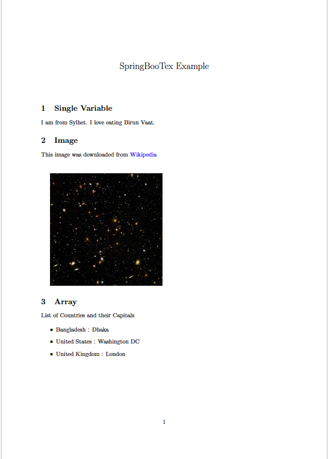

# SpringBooTex

SpringBooTex is PDF Generator REST Service which can be deplpyed out of the box. It can generate PDFs from LaTex and HTML Templates. It supports variable and file embeddings. 

Under the hood, it uses [pdfTeX / pdfLaTeX](https://tug.org/applications/pdftex) to create a PDF from a .tex file. For generating PDFs from HTML templates it uses [openhtmltopdf](https://github.com/danfickle/openhtmltopdf) and Thymeleaf.

## Getting Started
You can download the source code for SpringBooTex by running `git clone github.com/shuhanmirza/SpringBooTex` in your terminal.
After that you can run `docker-compose up --build`.

SpringBooTex will run as an REST service by default on port 10800; 

## Generating PDFs
PDF's are generated by sending an HTTP POST request to the endpoint "/api/generate-pdf" with a JSON payload:
```
{
    "templateType": "LATEX | HTML", 
    "templateSourceType": "BASE64",
    "templateSource": "TEMPLATE_SOURCE",
    "stringMap": { KEY_VALUE_MAP },
    "listMap" : { KEY_LIST_MAP },
    "fileUrlMap": { KEY_FILE_MAP },
    "responseType": "JSON | OCTET_STREAM | PDF"
}
```

### Example: Generating a PDF from latex template

See our example LaTex template in [`Doc/example.tex`](https://github.com/shuhanmirza/SpringBooTex/blob/main/Doc/example.tex)

You can see that, the variables are written between two `%` s.  
https://github.com/shuhanmirza/SpringBooTex/blob/49782f4cdd94a3e620f92739f7b37f381c3d77c0/Doc/example.tex#L12-L21

And the pdf has to embed an image named `universe.jpg`  
https://github.com/shuhanmirza/SpringBooTex/blob/49782f4cdd94a3e620f92739f7b37f381c3d77c0/Doc/example.tex#L37-L38

Let's prepare the JSON payload,

Now, encode the latex template to base64 by running:
```bash
cat example.tex | base64
```
Which gives output:
```
XGRvY3VtZW50Y2xhc3NbYTRwYXBlciwxMXB0XXthcnRpY2xlfQpcdXNlcGFja2FnZXtncmFwaGljeH0KXHVzZXBhY2thZ2VbZW1wdHlde2Z1bGxwYWdlfQpcdXNlcGFja2FnZXtoeXBlcnJlZn0KXGh5cGVyc2V0dXB7CiAgICBjb2xvcmxpbmtzPXRydWUsCiAgICB1cmxjb2xvcj1ibHVlLAogICAgYnJlYWtsaW5rcz10cnVlCn0KXHVzZXBhY2thZ2V7YXJyYXlqb2J9Clx1c2VwYWNrYWdle211bHRpZG99CgpcbmV3Y29tbWFuZHtcZm9vZH17JUZPT0QlfQpcbmV3Y29tbWFuZHtcY2l0eX17JUNJVFklfQoKXG5ld2FycmF5XENvdW50cnlMaXN0ClxuZXdhcnJheVxDaXR5TGlzdAoKXHJlYWRhcnJheXtDb3VudHJ5TGlzdH17JUNPVU5UUllfTElTVCV9ClxyZWFkYXJyYXl7Q2l0eUxpc3R9eyVDSVRZX0xJU1QlfQpcbmV3Y29tbWFuZHtcTGlzdFNpemV9eyVMSVNUX1NJWkUlfQoKClx0aXRsZXtTcHJpbmdCb29UZXggRXhhbXBsZX0KXGRhdGV7fQpcYmVnaW57ZG9jdW1lbnR9CgpcbWFrZXRpdGxlCgpcc2VjdGlvbntTaW5nbGUgVmFyaWFibGV9CgpJIGFtIGZyb20gXGNpdHkuIEkgbG92ZSBlYXRpbmcgXGZvb2QuCgpcc2VjdGlvbntJbWFnZX0KVGhpcyBpbWFnZSB3YXMgZG93bmxvYWRlZCBmcm9tIFxocmVme2h0dHBzOi8vdXBsb2FkLndpa2ltZWRpYS5vcmcvd2lraXBlZGlhL2NvbW1vbnMvdGh1bWIvMi8yZi9IdWJibGVfdWx0cmFfZGVlcF9maWVsZC5qcGcvMTAyNHB4LUh1YmJsZV91bHRyYV9kZWVwX2ZpZWxkLmpwZ317V2lraXBlZGlhfQoKXHZzcGFjZXsxY219ClxpbmNsdWRlZ3JhcGhpY3Nbc2NhbGU9MC4yXXt1bml2ZXJzZS5qcGd9Cgpcc2VjdGlvbntBcnJheX0KCkxpc3Qgb2YgQ291bnRyaWVzIGFuZCB0aGVpciBDYXBpdGFscwoKXGJlZ2lue2l0ZW1pemV9CiAgICBcbXVsdGlkb3tcaT0xKzF9e1xMaXN0U2l6ZX17CiAgICAgICAgXGl0ZW0gXENvdW50cnlMaXN0KFxpKSA6IFxDaXR5TGlzdChcaSkKICAgIH0KXGVuZHtpdGVtaXplfQoKXGVuZHtkb2N1bWVudH0K
```

The JSON payload should look like this,
```json
{
    "templateType": "LATEX",
    "templateSourceType": "BASE64",
    "templateSource": "XGRvY3VtZW50Y2xhc3NbYTRwYXBlciwxMXB0XXthcnRpY2xlfQpcdXNlcGFja2FnZXtncmFwaGljeH0KXHVzZXBhY2thZ2VbZW1wdHlde2Z1bGxwYWdlfQpcdXNlcGFja2FnZXtoeXBlcnJlZn0KXGh5cGVyc2V0dXB7CiAgICBjb2xvcmxpbmtzPXRydWUsCiAgICB1cmxjb2xvcj1ibHVlLAogICAgYnJlYWtsaW5rcz10cnVlCn0KXHVzZXBhY2thZ2V7YXJyYXlqb2J9Clx1c2VwYWNrYWdle211bHRpZG99CgpcbmV3Y29tbWFuZHtcZm9vZH17JUZPT0QlfQpcbmV3Y29tbWFuZHtcY2l0eX17JUNJVFklfQoKXG5ld2FycmF5XENvdW50cnlMaXN0ClxuZXdhcnJheVxDaXR5TGlzdAoKXHJlYWRhcnJheXtDb3VudHJ5TGlzdH17JUNPVU5UUllfTElTVCV9ClxyZWFkYXJyYXl7Q2l0eUxpc3R9eyVDSVRZX0xJU1QlfQpcbmV3Y29tbWFuZHtcTGlzdFNpemV9eyVMSVNUX1NJWkUlfQoKClx0aXRsZXtTcHJpbmdCb29UZXggRXhhbXBsZX0KXGRhdGV7fQpcYmVnaW57ZG9jdW1lbnR9CgpcbWFrZXRpdGxlCgpcc2VjdGlvbntTaW5nbGUgVmFyaWFibGV9CgpJIGFtIGZyb20gXGNpdHkuIEkgbG92ZSBlYXRpbmcgXGZvb2QuCgpcc2VjdGlvbntJbWFnZX0KVGhpcyBpbWFnZSB3YXMgZG93bmxvYWRlZCBmcm9tIFxocmVme2h0dHBzOi8vdXBsb2FkLndpa2ltZWRpYS5vcmcvd2lraXBlZGlhL2NvbW1vbnMvdGh1bWIvMi8yZi9IdWJibGVfdWx0cmFfZGVlcF9maWVsZC5qcGcvMTAyNHB4LUh1YmJsZV91bHRyYV9kZWVwX2ZpZWxkLmpwZ317V2lraXBlZGlhfQoKXHZzcGFjZXsxY219ClxpbmNsdWRlZ3JhcGhpY3Nbc2NhbGU9MC4yXXt1bml2ZXJzZS5qcGd9Cgpcc2VjdGlvbntBcnJheX0KCkxpc3Qgb2YgQ291bnRyaWVzIGFuZCB0aGVpciBDYXBpdGFscwoKXGJlZ2lue2l0ZW1pemV9CiAgICBcbXVsdGlkb3tcaT0xKzF9e1xMaXN0U2l6ZX17CiAgICAgICAgXGl0ZW0gXENvdW50cnlMaXN0KFxpKSA6IFxDaXR5TGlzdChcaSkKICAgIH0KXGVuZHtpdGVtaXplfQoKXGVuZHtkb2N1bWVudH0K",
    "stringMap": {
        "FOOD": "Birun Vaat",
        "CITY": "Sylhet",
        "LIST_SIZE": "3"
    },
    "listMap" : {
        "COUNTRY_LIST" : [
            "Bangladesh",
            "United States",
            "United Kingdom"
        ],
        "CITY_LIST" : [
            "Dhaka",
            "Washington DC",
            "London"
        ]
    },
    "fileUrlMap": {
        "universe.jpg": "https://upload.wikimedia.org/wikipedia/commons/thumb/2/2f/Hubble_ultra_deep_field.jpg/1024px-Hubble_ultra_deep_field.jpg"
    },
    "responseType": "PDF"
}
```
  

And the generated PDF is  



## Contributing
Please!

## Inspiration
- [LaTTe](https://github.com/raphaelreyna/latte)